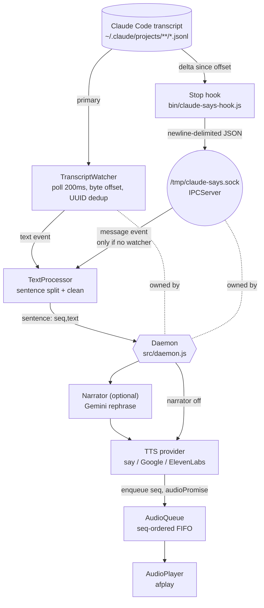

# Architecture — claude-says (claude-code-speak)

A real-time text-to-speech companion for the Claude Code CLI. It watches Claude
Code's session transcript and speaks new assistant output aloud, optionally
rephrasing it through an LLM "narrator" first.

> Scope: this document describes how the system is wired and why. For known
> defects see [CODE_REVIEW.md](CODE_REVIEW.md); for security/privacy see
> [SECURITY_AUDIT.md](SECURITY_AUDIT.md).

---

## 1. Two runtime processes

The product is two cooperating Node processes that meet at a Unix domain socket
(`/tmp/claude-says.sock`):

| Process | Entry point | Lifetime | Job |
|---|---|---|---|
| **Daemon** | [bin/claude-says.js](../bin/claude-says.js) → [src/daemon.js](../src/daemon.js) | Long-running | Ingest text, synthesize speech, play it in order |
| **Hook** | [bin/claude-says-hook.js](../bin/claude-says-hook.js) | One short run per event | Push new transcript text to the daemon, then exit |

The hook is registered into `~/.claude/settings.json` as a Claude Code **Stop**
hook by the setup wizard ([src/setup.js](../src/setup.js#L84)). It must finish
fast so it never blocks Claude's output — it self-limits to a hard 3-second
timeout ([bin/claude-says-hook.js:94](../bin/claude-says-hook.js#L94)).

There are **two independent ways** text reaches the daemon, and only one is
active at a time:

1. **TranscriptWatcher (primary).** The daemon polls a session's JSONL transcript
   directly and needs no hook at all.
2. **Hook → IPC (fallback).** When the daemon is *not* watching a transcript, it
   accepts text pushed over the socket by the hook.

The daemon prefers the watcher: the IPC handler ignores incoming messages
whenever a watcher object exists ([src/daemon.js:46](../src/daemon.js#L46)).

---

## 2. Data flow

```
Claude Code transcript (JSONL, append-only)
        │
        ├─(A) TranscriptWatcher  poll every 200ms ───┐
        │      src/transcript-watcher.js             │
        │                                            ▼
        └─(B) Stop hook reads delta ── IPC socket ── TextProcessor
               bin/claude-says-hook.js   src/ipc.js   src/text-processor.js
                                                        │  split into sentences,
                                                        │  strip markdown / code / URLs
                                                        ▼
                                            (optional) Narrator  ── Gemini API
                                                        │          src/narrators/gemini.js
                                                        ▼
                                            TTS provider .synthesize(text) → {audio, format}
                                                        │   say | Google Cloud | ElevenLabs
                                                        ▼
                                            AudioQueue  (sequence-ordered FIFO)
                                                        │   src/audio-queue.js
                                                        ▼
                                            AudioPlayer → afplay (macOS)
                                                            src/player.js
```



---

## 3. Components

| Component | File | Responsibility | Talks to |
|---|---|---|---|
| `Daemon` | [src/daemon.js](../src/daemon.js) | Orchestrator: wires everything, picks the session, routes `sentence` → synth → queue, handles session switching and shutdown | all of the below |
| `IPCServer` / `sendToSocket` | [src/ipc.js](../src/ipc.js) | Unix-socket server (daemon) and one-shot client (hook); newline-delimited JSON | Daemon, Hook |
| `TranscriptWatcher` | [src/transcript-watcher.js](../src/transcript-watcher.js) | Poll a JSONL file, read new bytes, emit each new assistant text block; dedupe by message UUID | Daemon |
| `TextProcessor` | [src/text-processor.js](../src/text-processor.js) | Buffer streamed text, split into sentences, strip markdown/URLs/paths, skip code & noise, assign `seq` | Daemon |
| `Narrator` (factory) | [src/narrator.js](../src/narrator.js) → [src/narrators/gemini.js](../src/narrators/gemini.js) | Optional LLM rephrase of text into 1–2 spoken sentences | Daemon |
| TTS factory + providers | [src/tts.js](../src/tts.js), [src/providers/](../src/providers/) | `synthesize(text) → {audio, format}` and `validate()` | Daemon, Setup |
| `AudioQueue` | [src/audio-queue.js](../src/audio-queue.js) | Sequence-ordered FIFO; plays audio in `seq` order regardless of TTS completion order | AudioPlayer |
| `AudioPlayer` | [src/player.js](../src/player.js) | Write audio buffer to a temp file, play via `afplay`, clean up | — |
| `config` | [src/config.js](../src/config.js) | Load/save `~/.claude-says/config.json` over `DEFAULT_CONFIG`; exports `SOCKET_PATH` | everyone |
| `sessions` | [src/sessions.js](../src/sessions.js) | Discover sessions under `~/.claude/projects/`, resolve transcript paths, sort by mtime | Daemon, CLI |
| `setup` | [src/setup.js](../src/setup.js) | Interactive wizard: validate TTS, test playback, install the Stop hook | CLI |
| CLI | [bin/claude-says.js](../bin/claude-says.js) | `commander` commands: `start` (default), `setup`, `sessions`, `providers`; interactive TTY controls | Daemon |

### Provider abstraction
Every TTS backend extends `BaseTTSProvider` ([src/providers/base.js](../src/providers/base.js))
and implements `async synthesize(text) → {audio: Buffer, format}` and
`async validate() → {ok, error?}`:

- [macos.js](../src/providers/macos.js) — shells out to `say` (default, zero config, lowest latency).
- [google.js](../src/providers/google.js) — Google Cloud TTS; **lazy-loads** `@google-cloud/text-to-speech` via `await import(...)` only on first use ([google.js:11](../src/providers/google.js#L11)).
- [elevenlabs.js](../src/providers/elevenlabs.js) — ElevenLabs REST over the `https` builtin.

The narrator uses the same factory pattern ([src/narrator.js](../src/narrator.js)),
currently with one implementation (Gemini, over `https`).

---

## 4. Concurrency & timing model

The system is a small set of timers and promise chains on a single event loop.

| Knob | Value | Where | Purpose |
|---|---|---|---|
| Transcript poll | **200 ms** | [transcript-watcher.js:4,31](../src/transcript-watcher.js#L4) | Detect new bytes (polling chosen over `fs.watch` for macOS reliability) |
| Incomplete-buffer flush | **1500 ms** | [text-processor.js:8,55](../src/text-processor.js#L55) | Speak a trailing fragment that never got a sentence terminator |
| Max chunk before force-flush | **500 chars** | [text-processor.js:7,86](../src/text-processor.js#L86) | Bound latency on very long unpunctuated text |
| IPC client send timeout | **100 ms** | [ipc.js:89](../src/ipc.js#L89) | Hook never blocks Claude's display |
| Hook hard timeout | **3000 ms** | [claude-says-hook.js:94](../bin/claude-says-hook.js#L94) | Hook can never hang the CLI |
| Narrator request timeout | **10 s** | [gemini.js:94](../src/narrators/gemini.js#L94) | Bound LLM latency; falls back to raw text |
| UUID dedup window | last **1000** (trim to 500) | [transcript-watcher.js:88](../src/transcript-watcher.js#L88) | Avoid re-speaking re-written messages, bounded memory |

### Ordering guarantee (the core design idea)
TTS calls are async and may finish **out of order** (a short sentence can return
before a long earlier one). The `AudioQueue` decouples *completion order* from
*playback order*:

1. `TextProcessor` assigns a monotonically increasing `seq` to each sentence
   ([text-processor.js:103](../src/text-processor.js#L103)).
2. The daemon calls `audioQueue.enqueue(seq, synthesizePromise)`
   ([daemon.js:82](../src/daemon.js#L82)) — the *promise*, not the audio.
3. The queue stores entries in a `Map` keyed by `seq` and `_drain()`s strictly in
   `nextToPlay` order, awaiting each `player.play()` before advancing
   ([audio-queue.js:55-97](../src/audio-queue.js#L55)). An entry that isn't ready
   yet blocks the drain until it resolves; a failed synth is skipped.

Because the narrator `await` happens *before* `enqueue`
([daemon.js:69-82](../src/daemon.js#L69)), even with a slow narrator the seq
order is preserved by the queue. The invariant the queue relies on is that
**every assigned `seq` is eventually enqueued** and numbering stays contiguous;
`reset()` ([text-processor.js:50](../src/text-processor.js#L50)) and `clear()`
([audio-queue.js:111](../src/audio-queue.js#L111)) zero `seq` and `nextToPlay`
together on session switch to keep them aligned.

---

## 5. State, paths, and configuration

| Path | Written by | Contents |
|---|---|---|
| `/tmp/claude-says.sock` | daemon | IPC listening socket |
| `/tmp/claude-says-audio/chunk-<ts>.{wav,mp3}` | player | transient audio, deleted after playback |
| `/tmp/claude-says-<ts>.aiff` | macOS provider | transient `say` output, deleted after read |
| `/tmp/claude-says-state/<sessionId>.offset` | hook | byte offset already forwarded per session |
| `/tmp/claude-says-hook.log` | hook | error log (append) |
| `~/.claude-says/config.json` | config/setup | provider, voices, narrator settings |
| `~/.claude/settings.json` | setup | the installed Stop hook entry |

`DEFAULT_CONFIG` ([config.js:9](../src/config.js#L9)) ships `provider: 'macos'`
so the tool works with **zero credentials** out of the box. Config is loaded by
spreading saved values over the defaults ([config.js:44](../src/config.js#L44)).

### Discovery
On startup with no explicit `--session`/`--transcriptPath`, the daemon
auto-selects the most-recently-modified transcript under `~/.claude/projects/`
([sessions.js:70](../src/sessions.js#L70), [daemon.js:152](../src/daemon.js#L152)).
If none is found it falls back to hook/IPC mode.

---

## 6. Extension points

**Add a TTS provider:** create `src/providers/<name>.js` extending
`BaseTTSProvider` with `synthesize()` + `validate()`, then register it in the
`PROVIDERS` map in [src/tts.js](../src/tts.js#L5). Keep any heavyweight SDK behind
a lazy `await import()` (as Google does) so it stays optional.

**Add a narrator:** create `src/narrators/<name>.js` with a `narrate(text)`
method and register it in [src/narrator.js](../src/narrator.js).

---

## 7. Dependency footprint — "why so many packages?"

**The product needs exactly one npm package at runtime: [`commander`](../package.json#L34)** (the CLI parser),
and `commander` itself has **zero** dependencies.

Everything else is built on the Node standard library or by shelling out to
macOS binaries — no third-party package involved:

| Capability | Implemented with | npm deps |
|---|---|---|
| Default TTS | macOS `say` via `child_process.execFile` | 0 |
| Audio playback | macOS `afplay` via `execFile` | 0 |
| ElevenLabs TTS | `https` builtin | 0 |
| Gemini narrator | `https` builtin | 0 |
| IPC | `net` Unix sockets | 0 |
| Transcript/state/config I/O | `fs`, `path`, `os` | 0 |
| CLI controls | `readline` | 0 |

So where do the "many packages" come from? The single **optional** dependency:

```jsonc
"optionalDependencies": { "@google-cloud/text-to-speech": "^5.0.0" }
```

That one package drags in a large tree — gRPC (`@grpc/grpc-js`), Protocol Buffers
(`protobufjs`), Google auth (`google-auth-library`, `gtoken`, `gaxios`),
`google-gax`, `node-fetch`, `form-data`, `yargs`, and dozens of small utilities.
Concretely, the committed [package-lock.json](../package-lock.json) resolves
**107 third-party packages**, of which **~106 belong to the Google Cloud TTS tree**
and **1 is `commander`**.

Two facts explain the perception:

1. **`npm install` installs `optionalDependencies` by default.** Unless you pass
   `--omit=optional`, npm pulls the entire Google tree even though the default
   `macos` provider never touches it.
2. **At runtime it is genuinely optional.** `@google-cloud/text-to-speech` is only
   ever loaded by `await import(...)` inside the Google provider
   ([google.js:11](../src/providers/google.js#L11)), and `tts.js` statically
   imports the provider *class* file (which does **not** import the SDK at module
   load). So a user on the default macOS provider can run the whole app even with
   the optional dep absent.

**Bottom line:** core install = `commander` (1 package, no sub-deps). The ~100+
packages appear only because the optional Google Cloud TTS backend is declared
and npm installs optionals by default. Install with `npm install --omit=optional`
to skip them entirely and still get full macOS / ElevenLabs / Gemini
functionality.

---

## 8. Tech stack

- Node.js ≥ 18, ES modules (`"type": "module"`)
- `commander` (CLI) — only required dependency
- `@google-cloud/text-to-speech` — optional, lazy-loaded
- macOS-specific: `say` (TTS), `afplay` (playback)
- No test framework, no TypeScript, no bundler
